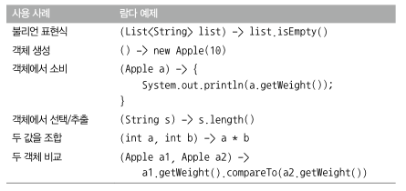
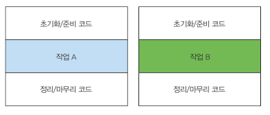

# 3 람다 표현식

- **익명 함수**의 일종
  - 이름은 없지만, 파라미터 리스트, 바디 , 반환 형식을 가지며 예외 throw 가능
- 간결한 코드 구현
- 함수형 인터페이스 = 하나의 추상 메서드만을 정의하는 인터페이스
- 함수형 인터페이스를 기대하는 곳에서만 사용 가능
- 람다 표현식 전체가 **함수형 인터페이스의 인스턴스**로 취급
- 실행 어라운드 패턴을 람다와 활용하면 **유연성과 재사용성**을 얻을 수 있음
- 람다 표현식의 **기대 형식 (type expected) = 대상 형식 (target type)**
- 메서드 참조를 이용, **기존의 메서드 구현을 재사용하고 직접 전달** 가능

## 3.1 람다란 무엇인가?

- 메서드로 전달할 수 있는 익명 함수를 단순화한 것
- 함수
  - 메서드처럼 특정 클래스에 종속되지 않으므로 함수라고 부름
  - 파라미터 리스트, 바디, 반환 형식, 가능한 예외 리스트를 포함
- 간결성
- 전달
  - 메서드 인수로 전달하거나 변수로 저장
- 함수형 인터페이스라는 문맥에서 사용

```java
// 기존 코드
Comparator<Apple> byWeight = new Comparator<Apple>() {
	public int compare(Apple a1, a2) {
		return a1.getWeight().compareTo(a2.getWeight());
	}
}

// 람다를 이용한 코드
Comparator<Apple> byWeight =
	(Apple a1, Apple a2) -> a1.getWeight().compareTo(a2.getWeight());
```

> 람다 표현식을 이용하면 메서드의 바디를 직접 전달하는 것처럼 코드 전달 가능


#### 람다 표현식 예제

```java
// String 형식의 파라미터 하나를 가지며 int를 반환 / return 이 함축되어있음
(String s) -> s.length()

// Apple 형식의 파라미터 하나를 가지며 boolean을 반환
(Apple a) -> a.getWeight() > 150

// int 형식의 파라미터 두개를 가지며 리턴값이 없다. 여러 행의 문장 포함 가능
(int x, int y) -> {
    System.out.println("Result:");
    System.out.println(x + y);
}

// 파라미터가 없으며 int 42를 반환
() -> 42

// Apple 형식의 파라미터 두 개를 가지며 int를 반환
(Apple a1, Apple a2) -> a1.getWeight().compareTo(a2.getWeight())
```



### 3.2.1 함수형 인터페이스

- 하나의 **추상 메서드를 지정**하는 인터페이스
- **전체 표현식을 함수형 인터페이스의 인스턴스로 취급**(함수형 인터페이스를 **구현한** 클래스의 인스턴스)가능


### 3.2.2 함수 디스크립터

- **함수형 인터페이스의 추상 메서드 시그니처**
- 람다 표현식의 시그니처를 서술하는 메서드


## 3.3 람다 활용 : 실행 어라운드 패턴



> 중복되는 준비 코드와 정리 코드가 작업 A 와 작업B 를 감싸고 있다.

- 자원을 처리하는 코드를 설정과 정리 두 과정이 둘러싸는 패턴

- 자원 처리에 사용하는 순환 패턴은 **자원을 열고, 처리한 다음, 자원을 닫는 순서**로 이루어짐 (설정과 정리 과정은 비슷)

```java
public String processFile() throws IOException {
	try (BufferedReader br = new BufferedReader(new FileReader("data.txt"))) {
		return br.readLine();	// 실제 작업을 진행하는 행
	}
}
```

- **1단계 : 동작 파라미터화**

  - processFile의 동작을 파라미터화 하여 기존의 설정, 정리 과정은 재사용하고 processFile 메서드만 다른 동작을 수행하도록 명령

  - ```java
    // processFile 메서드가 한 번에 두 행을 읽게 하기
    // BufferedReader를 인수로 받아서 String을 반환하는 람다
    String result = processFile((BufferedReader br) 
    								-> br.readLine() + br.readLine());
    ```

- **2단계 : 함수형 인터페이스를 이용해서 동작 전달**

  - 함수형 인터페이스 자리에 람다를 사용

  - ```java
    //BufferedReader -> String 과 IOException을 던질 수 있는 시그니처와 일치하는 함수형 인터페이스 생성
    @FunctionalInterface
    public interface BufferedReaderProcessor {
        String process(BufferedReader b) throws IOException;
    }
    
    // 정의한 인터페이스를 processFile 메서드의 인수로 전달
    public String processFile(BufferedReaderProcessor p) thorws IOException{
        
    }
    ```

- **3단계 : 동작실행**

  - 함수형 인터페이스의 추상 메서드 구현을 직접 전달

  - 전달된 코드는 함수형 인터페이스의 인스턴스로 전달된 코드와 같은 방식으로 처리

  - ```java
    // processFile 바디 내에서 BufferedReaderProcessor 객체의 process 호출
    public String processFile(BufferedReaderProcessor p) thorws IOException{
    	try (BufferedReader br = new BufferedReader(new FileReader("data.txt"))) {
    		return p.process(br);	// BufferedReader 객체 처리
    	}
    }
    ```

- **4단계 : 람다 전달**

  - ```java
    // 한 행을 처리하는 코드
    String oneLine = processFile((BufferedReader br) -> br.readLine());
    
    // 두 행을 처리하는 코드
    String twoLines = processFile((BufferedReader br) -> br.readLine() + br.readLine());
    ```


## 3.4 함수형 인터페이스 사용

### 3.4.1 Predicate

- Predicate<T> 인터페이스는 test 라는 추상 메서드를 정의
- test 는 제너릭 형식 T의 객체를 인수로 받아 boolean을 반환
- 정의할 필요 없이 바로 사용할 수 있다는 특징
- T 형식의 객체를 사용하는 boolean 표현식이 필요한 상황에서 사용


### 3.4.2 Consumer

- T 객체를 받아서 void를 반환하는 accept 추상 메서드를 정의
- T 형식의 객체를 인수로 받아서 어떠한 동작을 수행하고 싶을 때 사용


### 3.4.3 Function

- T를 인수로 받아서 제네릭 형식 R 객체를 반환하는 추상 메서드 apply를 정의
- 입력을 출력으로 매핑하는 람다를 정의할 때 활용


### 기본형 특화

- 제네릭 파라미터에는 참조형만 사용가능
- 박싱 
  - 기본형 -> 참조형 변환
- 언박싱
  - 참조형 -> 기본형 변환
- 오토박싱
  - 박싱과 언박싱이 자동으로 이루어짐


## 3.5 형식 검사, 형식 추론, 제약

### 3.5.1 형식 검사

- 사용되는 컨텍스트를 이용, 람다의 형식 추론 가능 -> 기대되는 람다 형식 = 대상 형식
- 형식 확인 과정 순서
  1. 메서드의 선언 확인
  2. 파라미터로 받은 형식(대상 형식)을 기대
  3. 함수형 인터페이스로 부터 정의된 추상 메서드 확인
  4. 정의된 추상 메서드가 반환하는 함수 디스크립터 확인
  5. 요구사항 만족


### 3.5.2 같은 람다, 다른 함수형 인터페이스

- 대상 형식이라는 특징 때문에 같은 람다 표현식이라도 호환되는 추상 메서드를 가진 다른 함수형 인터페이스로 사용 가능

> 다이아몬드 연산자
>
> - 컨텍스트에 따른 제네릭 형식 추론 가능
> - 주어진 클래스 인스턴스 표현식을 두 개 이상의 다양한 컨텍스트에 사용 가능
> - 인스턴스 표현식의 형식 인수는 컨텍스트에 의해 추론

> 특별한 void 호환 규칙
>
> - 람다의 바디에 일반 표현식이 있으면 void를 반환하는 함수 디스크립터와 호환 가능 (파라미터 리스트도 호환되어야 함)


### 3.5.3 형식 추론

- 자바 컴파일러는 람다 표현식이 사용된 컨텍스트(대상 형식)를 이용해서 람다 표현식과 관련된 함수형 인터페이스를 추론
- 컴파일러는 람다 표현식의 파라미터 형식에 접근 가능


### 3.5.4 지역 변수 사용

- 익명 함수가 하는 것 처럼 자유변수 활용 가능 -> **람다 캡처링**
  - 자유 변수 = 파라미터로 넘겨진 변수가 아닌 외부에서 정의된 변수
- 람다는 인스턴스 변수와 정적 변수를 자유롭게 캡처 할 수 있다
  - 지역 변수는 명시적으로 final로 선언되어 있어야 함
  - final로 선언된 변수와 똑같이 사용되어야 함
  - 한 번만 할당할 수 있는 지역 변수를 캡처할 수 있음
  - 인스턴스 변수 캡처 = final 지역 변수 this 캡처

> 지역 변수의 제약
>
> - 인스턴스 변수는 힙에 저장 / 지역 변수는 스택에 저장
> - 원래 변수에 접근을 허용하는 것이 아닌 자유 지역 변수의 복사본을 제공
>   - 람다에서 지역 변수에 바로 접근할 경우 스레드에서 실행된다면 변수를 할당한 스레드가 사라져 할당이 해제되었는데도 람다를 실행하는 스레드에서는 해당 변수에 접근 가능하기때문
> - 복사본의 값이 바뀌지 않아야 하므로 지역 변수에는 한 번만 값을 할당해야 한다는 제약이 생김


## 3.6 메서드 참조

- 기존의 메서드 정의를 **재활용**해서 람다처럼 전달 가능

### 3.6.1 요약

- 메서드명 앞에 구분자 **::** 를 붙이는 방식으로 메서드 참조 활용


- 메서드 참조를 만드는 방법
  1. 정적 메서드 참조
     - Integer의 parseInt -> Interger::parseInt
  2. 다양한 형식의 인스턴스 메서드 참조
     - String의 length -> String::length
  3. 기존 객체의 인스턴스 메서드 참조
     - Transaction 객체를 할당받은 지역 변수 expensiveTransaction
     - Transaction 객체의 getValue 메서드
       - expensiveTransaction::getValue

- 메서드 참조는 **컨텍스트의 형식과 일치**해야한다

```java
// 1. 자신의 인수를 Integer의 정적 메서드 parseInt로 전달 -> String을 인수로 받아 파싱 후 Integer를 반환
ToIntFunction<String> stringToInt = (String s) -> Integer.parseInt(s);
Function<String, Integer> stringToInteger = Integer::parseInt;

// 2. 첫 번째 인수의 contains 메서드 호출
BiPredicate<List<String>, String> contains = (list, element) -> list.contains(element);
BiPredicate<List<String>, String> contains = List::contains;

// 3. 비공개 헬퍼 메서드 호출
Predicate<String> startsWithNumber = (String string) -> this.startsWithNumber(string);
Predicate<String> startsWithNumber = this::startsWithNumber;
```

