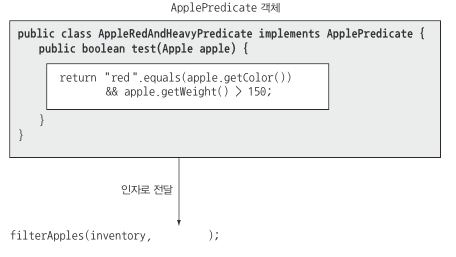
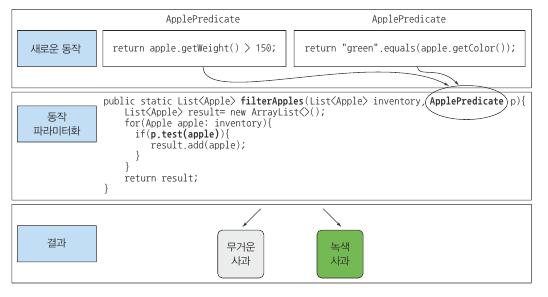

# 동작 파라미터화

- 메서드 내부적으로 **다양한 동작을 수행할 수 있도록** 메서드 인수로 전달
- **변화하는 요구사항에 더 잘 대응할 수 있는 코드 구현** 가능하며, 엔지니어링 비용 절감 가능
- 동작을 메서드의 인수로 전달 가능
  - 인터페이스를 상속받아 여러 클래스를 구현해야하는 수고를 줄일 수 있는 방법 제공

- 코드 블록에 따라 메서드의 동작이 파라미터화 된다.

  - 리스트의 모든 요소에 대해서 '어떤 동작'을 수행할 수 있음

  - 리스트 관련 작업을 끝낸 다음에 '어떤 다른 동작'을 수행할 수 있음

  - 에러가 발생하면 '정해진 어떤 다른 동작'을 수행할 수 있음

- 동작을 캡슐화한 후 -> 메서드로 전달 -> 메서드의 동작을 파라미터화

> filterApples의 동작을 파라미터화하고 다양한 필터 전달하기

> filterApples의 동작을 파라미터화하고 다양한 필터 전략 전달

